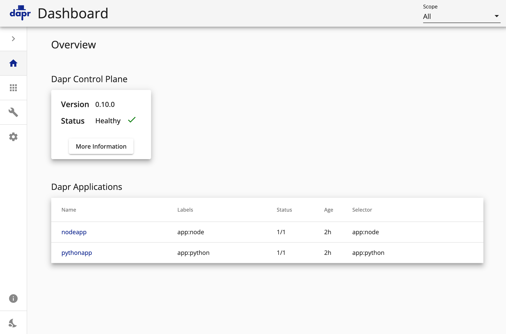
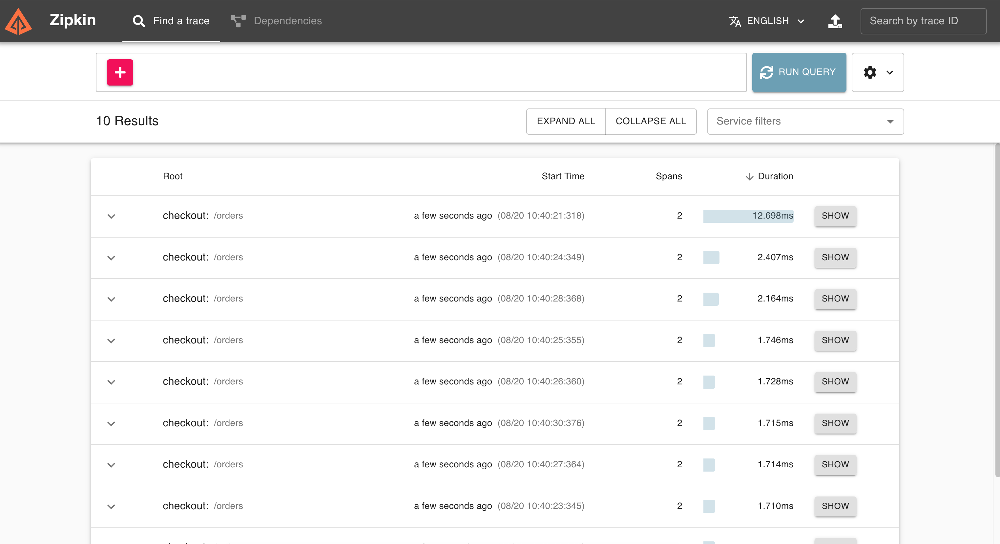
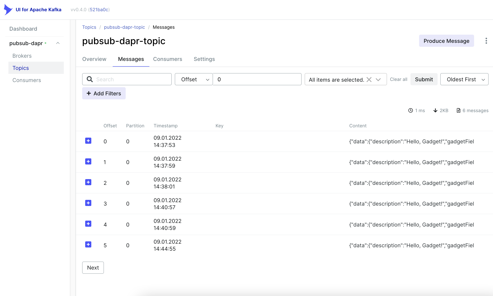

# DAPR over K8S

This project explains how to install DAPR over K8S with Ansible and Helm solutions.

## DAPR Overview

Dapr is an amazing middleware framework for cloud stack. This framework helps developper to create, use resilient and secured microservices mainly over a Kubernetes infrastructurefootnote:[a local installation is possible : https://docs.dapr.io/operations/hosting/self-hosted/]. Dapr for **D**istributed **Ap**plication **R**untime provide several piece for developers, integrators and operators who want run theirs application on a Kubernetes cluster. 
The main idea of Dapr is to wrap / abstract all tiers components within an _standardized_ API. Tier providers can easely integrate theirs components inside Dapr stack without any business app code modification.

Currently the stable version version of http://dapr.io[Dapr.io] is `1.8.4` (2022-08-22).

### Building blocks

Dapr brings lot a cool stuff like : 

* Service-to-service invocation
** Service call mechanism
* State management
** A store system for long living data
* Publish and subscribe
** Pub/Sub solution over Kafka or another MoM solution
* Secrets
** Keep sensitive information into secret mechanism
* Configuration
** Manage properties/values/parameters for client applications

### API

Because Dapr abstracts all backend with an API, Dapr provides two kinds of API.

* *REST API*
** Buildings blocks are exposed with a REST API, applications can directly call components throught this

* *Code API*
** Depending application language, Dapr supply several code librairies to talk to the REST API inside the application.

## HELM 

Helm system is the package manager for all software or solution running over Kubernetes. Helm provides the same user experience as _yum_, _apt_ but focus on Kubernetes technologies.
As Kubernetes, Helm is YAML first. Developer can create some powerful template for his application or solution. When Operator needs to install the solution, Helm merge the Helm package with some specifics values (Env values, k8s cluster values, package values, Business values). 

## Ansible

Ansible is a automation tool world wide used. This tool helps IT Ops to automate all technical configuration and deployment over any infrastructures : OnPremise, Cloud, Hybrid Cloud, Edge etc....
By using playbook, a YAML file including all commands designer by Ansible, Ops users can control, deploy, check lots of devices/services/vm/cloud infrastructure. Ansible separates execution and configuration, it means that you can reuse any playbook with another environment configuration smoothly.

## Let's run

To use this project you need at least :

* Openshift 4.10/Kubernetes
* Cluster admin
* Ansible 2.13+
* Helm 3.9+

### Install Dapr System with Helm

What's the playbook does :

. Create `dapr-system` NS
. Install Helm Chart Repo (DAPR and REDIS)
. Install DAPR Helm 
. Create a route to Dapr Dashboard
. Install Redis Helm 
. Install Zipkin Configuration

To run this playbook you need :

#### Clone this repository 

  git clone --recurse-submodules git@github.com:gautric/dapr-over-k8s.git

#### Execute the playbook

  ansible-playbook dapr-system.yaml

#### Check Dapr & Zipkin Dashboard deployment

* For Dapr Dashboard (Mac users)
 
  open -a Firefox   http://`kubectl --namespace dapr-system get Route -l name=dapr-dashboard --no-headers -o custom-columns=":spec.host" `

You should get this kind of output into your browser

   

* For Zipkin Dashboard (Mac users)
 
  open -a Firefox   http://`kubectl --namespace dapr-system get Route -l name=dapr-zipkin --no-headers -o custom-columns=":spec.host" `

You should get this kind of output into your browser

   

### Install Dapr Sample with Helm

What's the playbook does :

. Create `dapr-sample` NS
. Copy/Paste redis password for Dapr Componentfootnote:[to check]
. Deploy Node App
. Deploy Python App

#### Execute the playbook

  ansible-playbook dapr-sample.yaml

#### Check client / server application with log

  kubectl --namespace dapr-sample  logs `kubectl --namespace dapr-sample get pods -l app=node --no-headers -o custom-columns=":metadata.name"` node 

and 

  kubectl --namespace dapr-sample  logs `kubectl --namespace dapr-sample get pods -l app=python --no-headers -o custom-columns=":metadata.name"` python 

### Install Dapr Service Invocation with Helm

What's the playbook does :

. Create `dapr-service-invocation` NS
. Deploy Service Invocation with Helm chart
.. Checkout App (build, deploy, imagestream)
.. Order-Process App (build, deploy, imagestream)
.. Dapr Configuration for ServiceInvocation

#### Execute the playbook

  ansible-playbook dapr-service-invocation.yaml

#### Check client / server application with log

  kubectl --namespace dapr-service-invocation  logs `kubectl --namespace dapr-service-invocation get pods -l app=checkout --no-headers -o custom-columns=":metadata.name"` checkout -f

and 

  kubectl --namespace dapr-service-invocation  logs `kubectl --namespace dapr-service-invocation get pods -l app=order-processor --no-headers -o custom-columns=":metadata.name"` order-processor -f 

### Install Dapr Pub Sub with Helm

What's the playbook does :

. Create `dapr-pub-sub` NS
. Deploy Pub Sub with Helm chart
.. Checkout App (build, deploy, imagestream)
.. Order-Process App (build, deploy, imagestream)

#### Execute the playbook

  ansible-playbook dapr-pub-sub.yaml

#### Check client / server application with log

  kubectl --namespace dapr-pub-sub  logs `kubectl --namespace dapr-pub-sub get pods -l app=checkout --no-headers -o custom-columns=":metadata.name"` checkout -f

and 

  kubectl --namespace dapr-pub-sub  logs `kubectl --namespace dapr-pub-sub get pods -l app=order-processor --no-headers -o custom-columns=":metadata.name"` order-processor -f 

### Install Dapr Pub Sub and Redis with Helm

What's the playbook does :

. Create `dapr-pubsub-config` NS
. Deploy Pub Sub with Helm chart
.. Pub-App 
.. Sub-App
.. Kafka cluster and Topic creation
.. Dapr Configuration for PubSub over Redis

#### Execute the playbook

  ansible-playbook dapr-pub-sub-config.yaml

#### Check client / server application with log

  kubectl --namespace dapr-pubsub-config  logs `kubectl --namespace dapr-pubsub-config get pods -l app=pub-app --no-headers -o custom-columns=":metadata.name"` pub-app -f

and 

  kubectl --namespace dapr-pubsub-config  logs `kubectl --namespace dapr-pubsub-config get pods -l app=sub-app --no-headers -o custom-columns=":metadata.name"` sub-app -f 

### Install Dapr Pub Sub and Kafka with Helm

What's the playbook does :

. Create `dapr-pubsub-kafka` and `dapr-kafka` NS
. Deploy Pub Sub with Helm chart
.. Pub-App 
.. Sub-App
.. Kafka cluster and Topic creation
.. Dapr Configuration for PubSub over Kafka
++ Kafka UI

#### Execute the playbook

  ansible-playbook dapr-pub-sub-kafka.yaml

#### Post some events

  curl -X POST http://`kubectl --namespace dapr-pubsub-kafka get Route pub-app  --no-headers -o custom-columns=":spec.host"`/publish -H Content-Type:application/json --data @samples/pub-sub-config/messages/gadget.json

or

  curl -X POST http://`kubectl --namespace dapr-pubsub-kafka get Route pub-app  --no-headers -o custom-columns=":spec.host"`/publish -H Content-Type:application/json --data @samples/pub-sub-config/messages/widget.json

or

  curl -X POST http://`kubectl --namespace dapr-pubsub-kafka get Route pub-app  --no-headers -o custom-columns=":spec.host"`/publish -H Content-Type:application/json --data @samples/pub-sub-config/messages/thingamajig.json

#### Check client / server application with log

  kubectl --namespace dapr-pubsub-kafka  logs `kubectl --namespace dapr-pubsub-kafka get pods -l app=pub-app --no-headers -o custom-columns=":metadata.name"` pub-app -f

and 

  kubectl --namespace dapr-pubsub-kafka  logs `kubectl --namespace dapr-pubsub-kafka get pods -l app=sub-app --no-headers -o custom-columns=":metadata.name"` sub-app -f 

#### Retrieve message inside Kafka UI console

* For Kafka-UI Dashboard (Mac users)
 
  open -a Firefox "http://`kubectl --namespace dapr-pubsub-kafka get Route kafka-ui  --no-headers -o custom-columns=":spec.host"`/ui/clusters/pubsub-dapr/topics/pubsub-dapr-topic/messages?filterQueryType=STRING_CONTAINS&attempt=0&limit=100&seekDirection=FORWARD&seekType=OFFSET&seekTo=0::0"

You should get this kind of output :

   

### LINKS

* https://docs.dapr.io/operations/hosting/kubernetes/kubernetes-deploy/#install-with-helm-advanced
* https://docs.dapr.io/reference/arguments-annotations-overview/
* https://github.com/bitnami/charts/tree/master/bitnami/redis/#installing-the-chart
* https://docs.dapr.io/operations/monitoring/tracing/setup-tracing/
